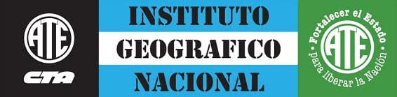

<!--

-->
# Instructivos
- [Reintegro coseguros Unión Personal](pages/up_reclamo.md)
- [ART: Accidentes y enfermedades laborales](pages/accidentes_trabajo.md)

# CIOT | CyMAT
Para velar por la equidad y no discriminación, así como la seguridad e higiene laboral, el [Convenio Colectivo de Trabajo General para la Administración Pública Nacional](https://www.argentina.gob.ar/normativa/nacional/114315/actualizacion) establece reuniones entre representantes del estado empleador y sindicatos en dos comisiones.
<!---
En IGN deben operar delegaciones de estas comisiones centrales para atender estas problemáticas en el Instituto.
-->

## Comisión de Igualdad de Oportunidades y Trato
- [CIOT Central](https://www.argentina.gob.ar/jefatura/gestion-y-empleo-publico/ciot)
  - [¿Qué es la CIOT?](https://www.argentina.gob.ar/jefatura/gestion-y-empleo-publico/ciot/institucional) 
  - [Presentación ATE reunión delegados CIOT 04-11-25](<https://github.com/ateign/ateign.github.io/raw/refs/heads/main/docs/Presentación reunión CIOT 4-11-25.pdf>)

- [¿Cómo presentar denuncias?](pages/ciot_denuncia.md)
- [Manual delegaciones CIOT](https://www.argentina.gob.ar/jefatura/gestion-y-empleo-publico/ciot/manual)

## Comisión de Condiciones y Medio Ambiente de Trabajo
- [¿Qué es la CyMAT?](https://www.argentina.gob.ar/jefatura/gestion-y-empleo-publico/empleo-publico/cymat)
  - [Preguntas frecuentes CyMAT](https://www.argentina.gob.ar/jefatura/gestion-y-empleo-publico/cymat/preguntas)
  - [Presentación ATE reunión delegados CyMAT 03-06-25](<https://github.com/ateign/ateign.github.io/raw/refs/heads/main/docs/CyMAT PDF.pdf>)
  
- [Reglamento delegación CyMAT IGN](https://www.ign.gob.ar/AreaInstitucional/RecursosHumanos/CyMAT)
- [Manual delegaciones CyMAT](https://www.argentina.gob.ar/sites/default/files/manual_delegaciones_cymat.pdf)

# ATE Capital
- [Beneficios para afiliados](https://atecapital.org/beneficios)
- [Oferta educativa y formativa](https://formacion.atecapital.org/)

