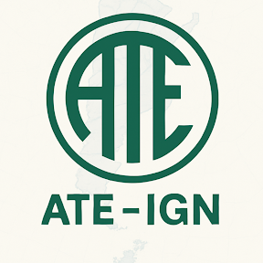

# Documentos
Aquí se publican enlaces a material de referencia para afiliados.

## Comisión de Igualdad de Oportunidades y Trato - CIOT

- [¿Qué es la CIOT?](https://www.argentina.gob.ar/jefatura/gestion-y-empleo-publico/ciot/institucional 
)
- [Presentación reunión CIOT 4-11-25](<docs/Presentación reunión CIOT 4-11-25.pdf>)

### ¿Cómo presentar denuncias?
Deben presentarse en forma escrita e individual en sobre cerrado con la leyenda: **DOCUMENTACIÓN CONFIDENCIAL para la DELEGACIÓN CIOT - IGN** y depositado en los buzones ubicados en planta baja del edificio técnico y administrativo.

## Comisión de Condiciones y Medio Ambiente de Trabajo - CyMAT

- [¿Qué es la CyMAT?](https://www.argentina.gob.ar/jefatura/gestion-y-empleo-publico/empleo-publico/cymat)

## ATE Capital
- [Beneficios para afiliados ATE Capital](https://atecapital.org/beneficios)