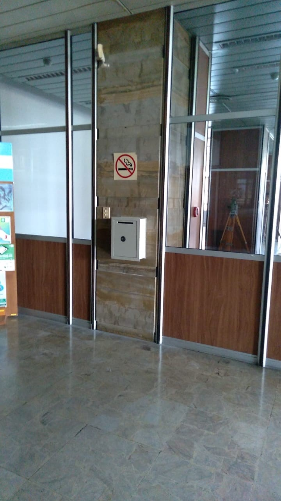

### ¿Cómo presentar una denuncia?
En un sobre cerrado con la leyenda: **DOCUMENTACIÓN CONFIDENCIAL para la DELEGACIÓN CIOT - IGN** debe presentarse un escrito que manifieste la denuncia a título individual en el que conste: 
- Nombre y apellido.
- Tipo y número de documento.
- Domicilio al que serán enviadas notificaciones.
- Teléfono (fijo o móvil) o dirección de correo electrónico.
- Dependencia donde cumplís tus funciones.
- Situación de revista: planta permanente (con [estabilidad o en el período de prueba](https://www.argentina.gob.ar/sites/default/files/i_manual_ingresantes_rrhh_12-4-2024.pdf)), contrato por tiempo determinado ([artículo 9° Ley 25164](https://www.argentina.gob.ar/normativa/nacional/ley-25164-60458/actualizacion)) o monotributista ([decreto 1109/17](https://www.argentina.gob.ar/normativa/nacional/decreto-1109-2017-305268/texto)).
- Si los conocés: nombre, apellido, cargo y situación de revista del denunciado/a. En su defecto, cualquier elemento que ayude a su individualización.
- Si la hay, indicá la relación jerárquica que mantenés con el denunciado/a. Si la misma no deriva de un nombramiento formal, indicá la identidad y el cargo de los funcionarios/as que, de hecho, hubiesen investido de autoridad a quien se indica como autor de la conducta denunciada.
- El relato de los hechos denunciados y, en cuanto fuese posible, las circunstancias de lugar, tiempo, modo de ejecución y demás elementos que puedan conducir a su esclarecimiento.
- Tu firmá en la denuncia.

**Depositar el sobre en alguno de los buzones ubicados en plantas bajas del edificio técnico o del administrativo.**
<!--

-->

Si tu denuncia es de **violencia laboral** podés realizarle en línea a través de la [plataforma de Trámites a Distancia (TAD)](https://www.argentina.gob.ar/servicio/presenta-tu-denuncia-de-violencia-laboral) ante la [CIOT central](https://www.argentina.gob.ar/jefatura/gestion-y-empleo-publico/empleo-publico/ciot) constituida en la Jefatura de Gabinete de Ministros.