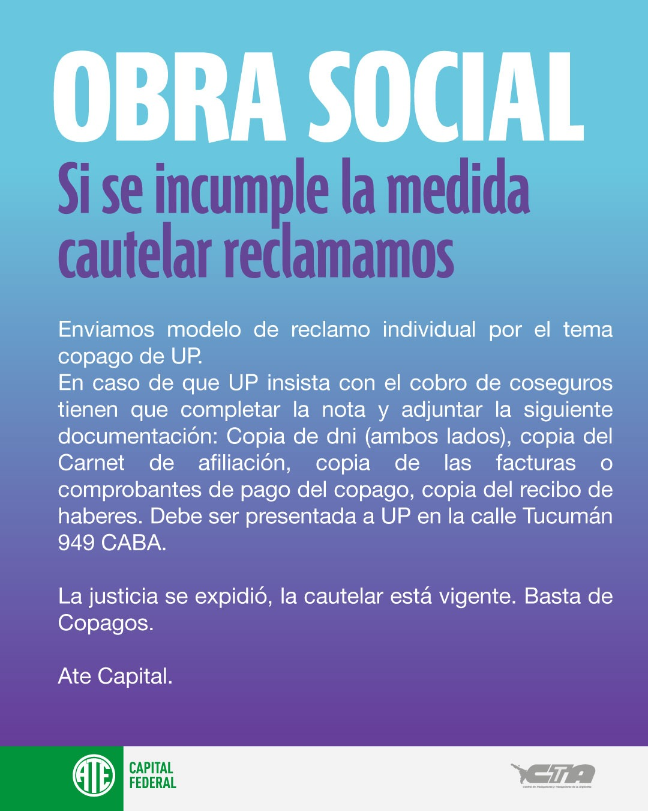

# Coseguros obra social Unión Personal

## Normativa sobre coseguros
En junio de 2024 la Superintendencia de Servicios de Salud del Ministerio de Salud de la Nación [quitó cualquier regulación sobre el monto de coseguros que quieran establecer los prestadores de salud](https://www.argentina.gob.ar/noticias/coseguros-una-modificacion-para-impulsar-la-competencia).
Permanecen exentos los siguientes estudios y prácticas preventivas que se detallan en el Anexo I de la [Resolución 1926/2024](https://www.boletinoficial.gob.ar/detalleAviso/primera/309532/20240624).

## Discriminación por parte de Unión Personal
En julio de 2025 la obra social Unión Personal (UP) decidió bonificar cobros de coseguros según afiliación sindical, lo cual constituye una práctica discriminatoria y contraria a la normativa vigente.

Desde el 13 de octubre de 2025, UP debiera abstenerse de esta práctica discriminatoria mientras se resuelve el fondo del asunto en la justicia según la [acción de amparo que fue favorable al reclamo de ATE](<https://github.com/ateign/ateign.github.io/raw/refs/heads/main/docs/Despacho%20CNT%2040843_2025%20-%20SENTENCIA%20INTERLOCUTORIA%20RESUEVE%20MEDIDA%20CAUTELAR%20-%20doc1654817163.pdf>)
.

A partir de tal fecha todos pueden registrar un reclamo para que se les restituya cualquier coseguro que sea bonificado a otra persona por su afiliación sindical.

### ¿Cómo reclamar por estos coseguros?

Para realizar un reclamo individual:
- **[Completar esta nota](<https://github.com/ateign/ateign.github.io/raw/refs/heads/main/docs/Reclamo%20individual%20copago%20UP.docx>)**
- Adjuntar copia de la siguiente documentación:
  - DNI (ambos lados)
  - Carnet de afiliación
  - Factura, ticket o comprobante del coseguro
  - Último recibo de haberes 
- Presentar en la mesa de entradas de Unión Personal en Tucumán 949, CABA.